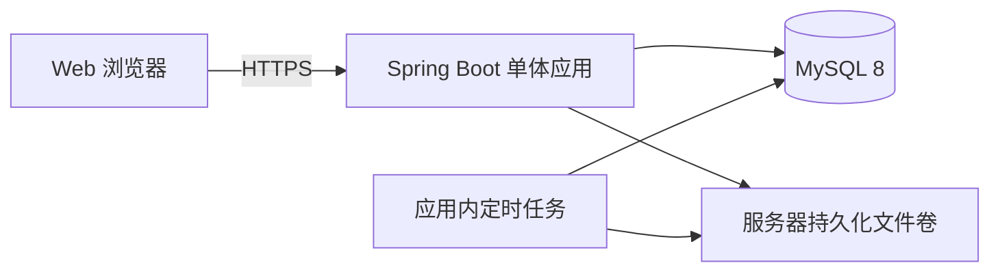
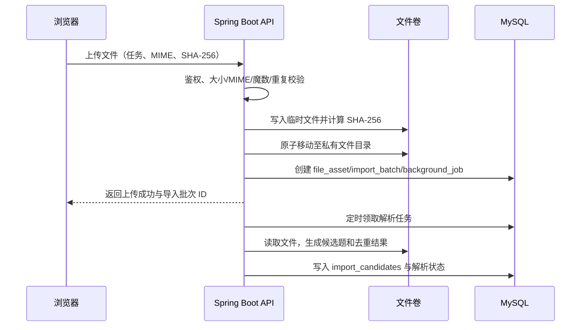

# 学习打卡系统后端技术选型与架构设计（V1.0）

## 1. 目标与最小化原则

V1.0 是可部署的 Web 服务，覆盖注册登录、多端同步、任务与打卡、图文题解、资料上传、PDF/DOCX/CSV 导入、去重和站内到期提示。

实施原则：

1. 不使用 Redis、RabbitMQ、微服务、独立 Worker 或对象存储。
2. 仅部署一个 Spring Boot 应用、一个 MySQL 实例和一个服务器持久化文件目录。
3. PDF/DOCX/CSV 解析通过数据库任务表和应用内定时任务处理，不阻塞上传请求。
4. 使用数据库唯一约束、事务、幂等键和乐观锁保证正确性。
5. V1.0 不做浏览器推送、邮件、短信或微信订阅消息；用户访问网站时查看站内到期/逾期状态。

## 2. 技术选型

| 领域 | V1.0 选型 | 理由 |
| --- | --- | --- |
| 架构 | 模块化单体 | 一个代码库、一个部署单元，适合首期快速迭代和低运维成本。 |
| 后端 | Java 21 LTS + Spring Boot 3.x + Spring MVC | 提供 Web、校验、安全、调度、监控和事务能力。 |
| 身份认证 | Spring Security + 数据库存储 Session Cookie + CSRF 防护 | 浏览器天然支持安全 Cookie，避免 JWT 刷新令牌和共享缓存。 |
| 密码 | Argon2id | 用于账号密码安全存储。 |
| 数据库 | MySQL 8.0 + Flyway | 任务、打卡、导入和去重需要事务、索引与唯一约束。 |
| 文件存储 | 服务器挂载数据卷 | V1.0 不引入云对象存储；容器通过 volume 持久化。 |
| 文件解析 | Apache PDFBox 3.x、Apache POI 5.x、OpenCSV | 分别解析 PDF 文本层、DOCX、CSV。 |
| 后台任务 | MySQL `background_jobs` + Spring `@Scheduled` | 以持久化任务和重试替代消息队列。 |
| API 文档 | springdoc-openapi（开发/测试环境） | 让 Web 前端和后端共享接口契约。 |
| 测试 | JUnit 5、Mockito、远程 MySQL 8 实例 | 覆盖领域规则、事务和数据库约束；连接信息仅通过环境变量注入，不使用 Testcontainers 或本地 MySQL。 |
| 健康检查 | Spring Boot Actuator + Logback | 保持最低可观测性。 |
| 部署 | Docker Compose | 单服务器运行 `app + mysql`，简单可复现。 |

## 3. 总体架构

### 3.1 单体模块

| 模块 | 职责 |
| --- | --- |
| `auth` | 注册、登录、登出、Session、密码修改。 |
| `user` | 用户资料、时区与站内提醒偏好。 |
| `task` | 清单型/习惯型任务的创建、编辑、暂停、归档、删除。 |
| `schedule` | 计划日计算、顺序分题、提前完成、顺延与连续天数。 |
| `item` | 题目、题库解析、排序与完成状态。 |
| `submission` | 用户文字题解、题解图片、草稿、提交和撤销。 |
| `file` | 上传、校验、哈希、私有下载和软删除。 |
| `importing` | 导入批次、解析、候选题、去重、人工确认入库。 |
| `job` | 后台任务领取、解析、重试、失败记录和定时清理。 |
| `audit` | 幂等、关键操作审计与版本冲突。 |

## 4. 注册登录与多端同步

### 4.1 账号方案

V1.0 使用邮箱加密码注册登录。邮箱唯一，用户可以在多个浏览器和设备登录同一账号。

1. `POST /api/v1/auth/register`：邮箱、密码、确认密码。
2. 密码使用 Argon2id 哈希入库，禁止保存明文或可逆密码。
3. `POST /api/v1/auth/login`：服务端创建会话，浏览器写入 `HttpOnly`、`Secure`、`SameSite=Lax` Cookie。
4. `POST /api/v1/auth/logout`：撤销服务端会话并清理 Cookie。
5. V1.0 不实现邮箱验证码、忘记密码和第三方 OAuth。生产上线前由管理员创建首个用户或后续接入邮件服务。

### 4.2 会话与 CSRF

1. `user_sessions` 保存随机会话令牌哈希、用户 ID、过期时间、最后访问时间和设备描述。
2. 浏览器只携带随机 Session ID，服务端查询数据库验证；会话建议有效 30 天并滚动续期。
3. 所有写操作必须携带 CSRF Token。前端从 `GET /api/v1/auth/csrf` 获取令牌，放入 `X-CSRF-Token`。
4. 登录、注册和密码修改使用单实例内存限流，应用重启后计数清空可接受。

### 4.3 同步与并发

1. 可编辑表增加 `version`、`updated_at` 和 `updated_by_session_id`。
2. 编辑任务和题解时提交 `If-Match-Version`；冲突返回 `409 Conflict` 与最新数据摘要。
3. 题解使用 `submission_versions` 保存历史版本，避免多端静默覆盖。
4. 完成题目、撤销完成、完成打卡和确认导入必须提交 `Idempotency-Key`；服务端持久化首次结果，重试直接返回。

## 5. 数据模型与约束

| 表 | 关键字段/约束 |
| --- | --- |
| `users` | `email` 唯一、`password_hash`、`timezone`、`status`。 |
| `user_sessions` | `user_id`、`token_hash` 唯一、`expires_at`、`revoked_at`。 |
| `tasks` | 用户、类型、状态、频率、目标、时区、提醒时间、`version`。 |
| `learning_items` | 任务、题目、解析、排序、状态、内容指纹；唯一 `(task_id, sort_order)`。 |
| `item_analysis_versions` | 题目解析补充版本与导入来源。 |
| `item_submissions` | 题目、用户、草稿/已提交、文字题解、`version`；唯一 `(item_id, user_id)`。 |
| `submission_versions` | 题解历史版本。 |
| `checkins` | 任务、计划日期、状态、计划/完成数量；唯一 `(task_id, checkin_date)`。 |
| `checkin_items` | 打卡与分配题目的关系；唯一 `(checkin_id, item_id)`。 |
| `import_batches` | 任务、文件、状态、解析统计、文件 SHA-256。 |
| `import_candidates` | 候选题、页码、置信度、重复结果与人工处理动作。 |
| `file_assets` | 用户、任务、用途、磁盘相对路径、SHA-256、MIME、大小、删除状态；唯一 `(task_id, sha256)`。 |
| `submission_files` | 题解与图片关系及排序。 |
| `background_jobs` | 任务类型、载荷、状态、重试数、下次运行时间、错误摘要、锁定时间。 |
| `idempotency_keys` | 用户、请求键、请求哈希、响应快照、过期时间；唯一 `(user_id, request_key)`。 |
| `audit_logs` | 用户、资源、操作、请求 ID、前后状态摘要。 |

数据库必须保证：同一任务同一计划日只有一条有效打卡；同一任务相同 SHA-256 文件只保留一个有效资源；同一题不得在同一日重复计数；所有资源查询与下载都校验当前用户归属。

完成单题要在一个事务内执行“有效题解校验 -> 题目状态变更 -> 当天进度更新 -> 审计日志与幂等结果入库”。

## 6. 文件上传、解析与去重

### 6.1 上传流程

浏览器以 `multipart/form-data` 将文件上传至应用。V1.0 限制单文件 50 MB，由单体应用接收上传可接受。应用先写临时目录并重新计算哈希，校验成功后原子移动到持久化文件卷。

### 6.2 文件规则

1. 根目录从 `APP_STORAGE_ROOT` 环境变量读取，例如 `/data/timeclock/files`；不得存到代码目录。
2. 服务端生成路径：`users/{userId}/tasks/{taskId}/{uuid}`；数据库只存相对路径。
3. 允许 PDF、DOCX、CSV、JPG、JPEG、PNG；同时校验扩展名、MIME 和文件魔数。
4. 原始资料和题解图片均私有，下载接口必须授权并以文件流返回；禁止暴露磁盘路径。
5. 单文件最大 50 MB；题解最多 9 张图片、每张最大 10 MB。
6. V1.0 不接入病毒扫描服务。上线环境应限制白名单、磁盘配额并做定期人工巡检；后续可接入扫描服务。

### 6.3 数据库后台任务

1. 上传完成后，在创建 `import_batches` 的同一事务中写入 `background_jobs`，类型为 `IMPORT_PARSE`。
2. `@Scheduled(fixedDelay = 5000)` 每 5 秒以 `SELECT ... FOR UPDATE SKIP LOCKED` 领取一条到期任务。
3. 解析成功写入 `import_candidates` 并标记 `REVIEW_READY`；失败保存受控错误摘要，指数退避最多重试 3 次。
4. 三次失败后标记 `FAILED`，用户可查看原因并重新上传。
5. PDF 仅支持可提取文本层；扫描 PDF 和图片只保存资料，不做 OCR。
6. 解析限制：最大 500 页、最大文本长度、单任务超时、受控内存。加密或损坏文件快速失败。

### 6.4 去重策略

#### 文件级

1. 浏览器可提交预计算 SHA-256，服务端必须对实际文件重算。
2. 按 `(task_id, sha256)` 查询有效资源；命中后直接返回既有导入批次或文件，不再解析。
3. 数据库唯一索引处理并发上传相同文件的竞争。

#### 题目级

1. 标题、题干、解析先执行 Unicode 规范化、全半角统一、空白折叠、题号/页眉页脚移除。
2. 规范化标题和题干生成精确内容指纹；命中即标记精确重复。
3. 未命中精确指纹的候选用 SimHash 与标题 Token Jaccard 相似度识别疑似重复。
4. 阈值：`>= 0.95` 精确重复；`0.80 - 0.95` 疑似重复；低于 `0.80` 为新增。
5. 用户在预览中选择跳过、保留新增或合并；不得自动覆盖完成状态、用户题解或原解析。
6. 合并时保留原题目 ID，新解析写入 `item_analysis_versions`。

## 7. 计划、打卡与统计

### 7.1 顺序分题

1. 用户访问当天任务或日结任务执行时，按任务时区创建当天 `checkin`。
2. 查询未完成题目并按 `sort_order ASC` 分配前 `daily_target_count` 道，写入 `checkin_items`。
3. 未完成的当天题目在下一计划日优先保留，剩余数量顺序补足。
4. 提前完成未分配题目只增加总进度，不生成未来打卡记录。
5. 提前完成未来已分配题目时，未来计划加载时跳过该题并按顺序补题。

### 7.2 完成、撤销、补打

1. 用户题解有非空文字或至少一张有效图片时，才能完成清单题。
2. 完成当天已分配题目，在事务内增加 `completed_count`；达到目标则标记当天 `completed`。
3. 撤销题目完成后，当天不再达标则回退为 `partial`，并局部重算连续天数。
4. 连续天数以 `checkins` 事实表为准，在同步事务中局部重算，V1.0 不需要异步读模型。
5. 补打校验三天窗口、补打原因和目标完成情况，状态标为 `makeup`，不计入连续天数。

## 8. 站内提醒与定时维护

| 任务 | 频率 | 实现 |
| --- | --- | --- |
| 到期/逾期状态 | 用户访问今日页 + 每小时 | 按任务时区、提醒时间和完成情况动态计算；不发送外部消息。 |
| 漏打结算 | 每小时 | 将已过计划日且未达标记录标记为 `partial` 或 `missed`。 |
| 文件解析 | 每 5 秒 | 领取到期 `IMPORT_PARSE` 任务。 |
| 软删除清理 | 每日凌晨 | 删除超过 30 天窗口的数据和文件。 |
| 会话/幂等键清理 | 每日凌晨 | 清理过期记录。 |

V1.0 以单应用实例部署为前提，因此不需要分布式锁。未来扩容时先增加数据库租约锁，再评估专用队列。

## 9. REST API 规范

### 9.1 统一约定

1. 路径前缀：`/api/v1`。
2. 普通接口使用 JSON，文件接口使用 `multipart/form-data`。
3. 防重写操作传 `Idempotency-Key`。
4. 编辑接口传 `If-Match-Version`，冲突返回 `409 Conflict`。
5. 成功：`{ "data": ..., "requestId": "..." }`；失败：`{ "error": { "code": "...", "message": "..." }, "requestId": "..." }`。

### 9.2 核心接口

| 模块 | 方法与路径 | 说明 |
| --- | --- | --- |
| 认证 | `POST /auth/register`、`POST /auth/login`、`POST /auth/logout` | 注册、登录、登出。 |
| 认证 | `GET /auth/me`、`GET /auth/csrf` | 当前用户与 CSRF Token。 |
| 今日页 | `GET /dashboard/today` | 今日任务、站内提示、连续打卡摘要。 |
| 任务 | `GET/POST /tasks`、`GET/PATCH/DELETE /tasks/{taskId}` | 任务管理。 |
| 题目 | `GET /tasks/{taskId}/items`、`GET /items/{itemId}` | 题目列表与详情。 |
| 题目 | `PUT /items/{itemId}/submission` | 保存/提交图文题解。 |
| 题目 | `POST /items/{itemId}/complete`、`POST /items/{itemId}/reopen` | 完成或撤销。 |
| 打卡 | `GET /tasks/{taskId}/checkins/{date}` | 指定日期计划和进度。 |
| 打卡 | `POST /tasks/{taskId}/checkins/{date}/complete` | 习惯型打卡。 |
| 打卡 | `POST /tasks/{taskId}/checkins/{date}/makeup` | 补打。 |
| 上传 | `POST /tasks/{taskId}/files` | 上传资料或题解图片。 |
| 文件 | `GET /files/{fileId}/download` | 授权后下载/预览私有文件。 |
| 导入 | `GET /imports/{batchId}`、`GET/PATCH /imports/{batchId}/candidates` | 解析状态和候选题处理。 |
| 导入 | `POST /imports/{batchId}/confirm` | 确认题目入库。 |

## 10. 安全、部署与维护

### 10.1 安全

1. 全站 HTTPS；生产关闭 Swagger UI、详细异常和管理端点。
2. Session Cookie 使用 `HttpOnly`、`Secure`、`SameSite=Lax`；写请求强制 CSRF 校验。
3. 密码用 Argon2id；日志不得记录密码、Session ID、原文件磁盘路径或题解正文。
4. 页面展示题解和解析时 HTML 转义，不接受或渲染用户 HTML。
5. 上传校验扩展名、MIME、魔数和大小；下载必须校验用户与资源归属。
6. 登录、注册、上传、完成题目、确认导入、补打使用单实例内存限流。
7. SQL 使用参数化查询；关键操作写入审计日志。

### 10.2 部署

Docker Compose 最小部署包含：

| 服务 | 说明 |
| --- | --- |
| `app` | Spring Boot Web/API 与应用内定时任务，挂载 `app-files:/data/timeclock/files`。 |
| `mysql` | MySQL 8.0，挂载 `mysql-data:/var/lib/mysql`。 |

Nginx 或 Caddy 在宿主机/第三容器中终止 HTTPS 并代理到 `app`。数据库、文件卷和环境变量文件必须纳入备份。

### 10.3 最低监控与备份

1. Actuator 提供 `/actuator/health` 健康检查。
2. 日志携带 `requestId`，错误写独立错误日志。
3. 每日备份 MySQL 和文件卷，每月验证一次恢复。
4. 监控磁盘容量、MySQL 慢查询、后台任务失败数和解析失败率。

## 11. 开发顺序

| 阶段 | 交付内容 | 验收重点 |
| --- | --- | --- |
| M1 | Spring Boot、MySQL/Flyway、邮箱注册登录、Session/CSRF、任务 CRUD | 同一账号可在两个浏览器登录，用户间数据隔离。 |
| M2 | 清单/习惯任务、顺序分题、图文题解、完成/撤销、今日页、日历 | 完成和撤销正确更新当天状态和连续天数。 |
| M3 | 文件卷、上传校验、PDF/DOCX/CSV 解析任务、预览确认 | 样本 Java PDF 可跨页解析并人工校对入库。 |
| M4 | 文件/题目去重、补打、站内提醒、审计和定时清理 | 重复上传不重复入库，失败解析可查询并重新上传。 |
| M5 | Docker Compose、备份恢复、健康检查、压测和上线检查 | 满足 V1.0 稳定性与数据安全要求。 |

## 12. 后续演进边界

| 触发信号 | 后续升级 |
| --- | --- |
| 多实例 API 部署 | 为定时任务增加数据库租约锁；Session 转共享存储或 JWT。 |
| 解析积压、文件量快速增长 | 引入对象存储和专业队列，将解析拆为独立 Worker。 |
| 需要主动通知 | 引入邮件、浏览器推送或移动端通知服务。 |
| 高并发读热点 | 再评估 Redis 缓存和限流。 |
| 智能分题/AI 处理 | 引入独立规则或 AI 服务，保持事务核心稳定。 |

在这些信号出现前，Redis、RabbitMQ、对象存储和微服务只会增加复杂度，不应进入 V1.0。
