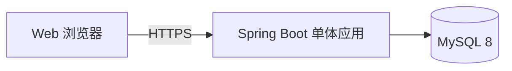

# 学习打卡系统后端技术选型与架构设计（V1.0 精简版）

## 1. 目标与最小化原则

V1.0 面向 1~10 人，只有一个核心业务：清单型刷题任务。用户登录后导入题目、按每日数量完成题解、查看打卡历史与连续天数。

1. 一个 Spring Boot 应用、一个 MySQL 8 实例；不使用 Redis、RabbitMQ、微服务、对象存储或独立 Worker。
2. 题目导入只支持 xlsx，上传请求内同步解析并返回预览；不做 PDF/DOCX/OCR/异步导入。
3. 题解只保存文字；不做图片上传、文件卷、附件下载。
4. 使用数据库唯一约束、事务和幂等键保证正确性；不做复杂读模型和高并发优化。
5. 任务仅支持清单型和 daily 频率；不做习惯型、暂停、归档、提前完成。

## 2. 技术选型

| 领域 | V1.0 选型 | 理由 |
| --- | --- | --- |
| 架构 | 模块化单体 | 低人数、低运维成本 |
| 后端 | Java 21 LTS + Spring Boot 3.x + Spring MVC | Web、校验、安全、事务与调度 |
| 身份认证 | Spring Security + 数据库存储 Session Cookie + CSRF | 浏览器安全会话 |
| 密码 | Argon2id | 安全存储密码 |
| 数据库 | MySQL 8.0 + Flyway | 事务、唯一约束与历史查询 |
| xlsx 解析 | Apache POI 5.x（`poi-ooxml`） | 只支持用户确认的 xlsx 导入 |
| API 文档 | springdoc-openapi（开发/测试环境） | 前后端共享契约 |
| 测试 | JUnit 5、Mockito、远程 MySQL 8 | 真实验证事务和约束；连接信息仅环境变量注入 |
| 健康检查 | Spring Boot Actuator + Logback | 最低可观测性 |
| 部署 | Docker Compose 或现有服务器进程 | 单应用 + MySQL |

不引入 PDFBox、OpenCSV、文件存储、后台导入任务、对象存储、消息队列。

## 3. 总体架构

### 3.1 单体模块

| 模块 | 职责 |
| --- | --- |
| `auth` | 注册、登录、登出、Session、CSRF |
| `user` | 用户基础信息与时区默认值（仅必要字段） |
| `task` | 清单任务创建、编辑、启用、物理删除 |
| `schedule` | daily 计划日、按序分配、顺延、连续天数计算 |
| `item` | 题目、解析、排序、文字题解、完成/撤销 |
| `checkin` | 打卡记录、漏打结算、补打、月历查询 |
| `importing` | xlsx 同步解析、预览、标题去重、确认入库 |
| `audit` | 幂等键与必要操作审计；不保存题解全文到日志 |

不建立 `habit`、`file`、`job`、`submission` 独立模块。

## 4. 认证与会话

1. `POST /api/v1/auth/register`：邮箱、密码、确认密码。
2. `POST /api/v1/auth/login`：验证 Argon2id，创建数据库 Session。
3. `POST /api/v1/auth/logout`：撤销当前会话并清除 Cookie。
4. `GET /api/v1/auth/me`、`GET /api/v1/auth/csrf`：会话恢复与 CSRF Token。
5. Cookie 使用 `HttpOnly`、`Secure`、`SameSite=Lax`；Session 默认 30 天，最后访问超过 15 天滚动续期。
6. 注册/登录采用单实例内存限流。多浏览器可同时登录，但 V1.0 不提供设备管理页面。

## 4.1 S1 认证实现状态

S1 已落地以下认证运行时组件：

| 组件 | 位置 | 职责 |
| --- | --- | --- |
| 注册/登录服务 | `auth/AuthService.java` | 邮箱规范化、Argon2id、统一登录失败、失败限流 |
| Session 服务 | `auth/SessionService.java` | 随机 Token、SHA-256 Hash、创建/查询/撤销/续期 |
| Session Filter | `auth/SessionAuthenticationFilter.java` | Cookie 会话恢复与当前用户注入 |
| Cookie 工具 | `auth/AuthCookie.java` | `SESSION_ID` 安全属性与清除 |
| Security 配置 | `auth/AuthSecurityConfig.java` | CSRF、无状态认证、端点权限 |

认证 Cookie 固定使用 `HttpOnly; Secure; SameSite=Lax; Path=/`，有效期 30 天；Session 原文不入库。S1 测试使用 `application-test.yml` 对应的独立 MySQL 8 测试库。

| 表 | 关键字段/约束 |
| --- | --- |
| `users` | `email` 唯一、`password_hash`、`timezone`、审计字段 |
| `user_sessions` | `user_id`、`token_hash` 唯一、过期/撤销时间 |
| `tasks` | 用户、名称、daily 目标、时区、开始/结束日期、`draft/active` |
| `learning_items` | 任务、标题、正文、解析、外链、序号、状态、文字题解、完成时间；唯一 `(task_id, sort_order)` |
| `checkins` | 任务、计划日期、状态、计划/完成数量、补打原因；唯一 `(task_id, checkin_date)` |
| `idempotency_keys` | 用户、请求键、请求哈希、响应快照、过期时间；唯一 `(user_id, request_key)` |
| `audit_logs` | 用户、资源、操作、请求 ID、状态摘要（不保存敏感正文） |

V1.0 不建立 `checkin_items` 分配关系表。今日分配按顺延规则由任务条目状态与计划日事实计算；实现必须保证同一条目一次完成只计入一个日期。

物理删除任务时在同一事务中删除其条目、打卡和导入候选数据；数据库外键使用级联或服务层明确删除顺序。

## 6. xlsx 导入

### 6.1 流程

1. 浏览器以 `multipart/form-data` 上传 `.xlsx`。
2. 服务端鉴权、校验扩展名/MIME/文件大小后用 POI 同步读取。
3. 固定列：`title` 必填；`content`、`analysis`、`link`、`order` 可选。
4. 返回候选列表、有效条数、错误行与简单重复标记；此时不写正式条目。
5. 用户确认后在事务中执行去重处理并追加正式条目。

### 6.2 简单去重

- 将标题 trim、折叠空白后比较；与当前任务既有条目同标题的候选标记为重复。
- 默认 `skip`；用户可选择 `keep_new`。不做合并、覆盖、SimHash、文件哈希去重。
- 新条目追加到现有最大序号之后，不改历史打卡、完成状态或题解。
- xlsx 损坏、缺 title、超过行数上限时返回受控 422，不写正式条目。

## 7. 计划、完成与统计

1. active 且任务时区当天符合 daily 计划时，按序选择未完成条目；目标为每日目标与剩余数较小值。
2. 上一计划日未完成的条目在下一计划日优先出现，再按序补足。
3. 非今日目标条目不提供完成操作，V1.0 不支持提前完成。
4. 有效题解为 `solution_text` 去空白后非空。
5. 完成条目在事务内更新条目、今日完成数量和打卡状态；达到目标即 `completed`。
6. 同一完成、撤销、补打、导入确认写操作使用 `Idempotency-Key`。
7. 计划日结束后可由每小时定时任务把无记录日期置为 `missed`、未达标日期置为 `partial`；若暂不启用调度，首次访问历史/日历时必须幂等结算。
8. 连续天数只统计 `completed`；无计划日跳过；`partial`/`missed` 中断；`makeup` 不连接。
9. 补打只允许任务时区下过去 3 天（不含今天），原因必填，提交后不可编辑/撤销。

## 8. REST API 规范

统一前缀 `/api/v1`。成功 `{data, requestId}`，失败 `{error:{code,message},requestId}`。

| 模块 | 方法与路径 | 说明 |
| --- | --- | --- |
| 认证 | `POST /auth/register`、`POST /auth/login`、`POST /auth/logout` | 认证 |
| 认证 | `GET /auth/me`、`GET /auth/csrf` | 会话与 CSRF |
| 今日 | `GET /dashboard/today` | 今日任务、进度、连续摘要 |
| 任务 | `GET/POST /tasks`、`GET/PATCH/DELETE /tasks/{taskId}` | 任务管理 |
| 任务 | `POST /tasks/{taskId}/activate` | 草稿启用 |
| 条目 | `GET/POST /tasks/{taskId}/items`、`GET/PATCH /items/{itemId}` | 手工条目 |
| 条目 | `POST /items/{itemId}/complete`、`POST /items/{itemId}/reopen` | 完成/撤销 |
| 计划 | `GET /tasks/{taskId}/plan/{date}` | 指定日期计划与进度 |
| 打卡 | `GET /calendar`、`GET /tasks/{taskId}/checkins/{date}` | 月历与日期详情 |
| 打卡 | `POST /tasks/{taskId}/checkins/{date}/makeup` | 补打 |
| 导入 | `POST /tasks/{taskId}/imports/xlsx/preview` | xlsx 预览，不入库 |
| 导入 | `POST /tasks/{taskId}/imports/xlsx/confirm` | 确认候选入库 |

所有写接口 CSRF；完成、撤销、补打、导入确认使用幂等键；资源均服务端校验用户归属。

## 9. 安全、部署与维护

1. 全站 HTTPS；生产关闭 Swagger UI 和详细异常。
2. 用户输入按纯文本展示，禁止 `dangerouslySetInnerHTML`。
3. SQL 参数化；不记录密码、Cookie、CSRF、题解全文或数据库凭据。
4. 物理删除需要前端二次确认，后端只依据请求参数和用户归属执行。
5. Actuator 只暴露 health/info；日志包含 requestId。
6. 仅配置会话/幂等键定期清理；不做文件清理、解析任务清理或软删除清理。

## 10. 开发顺序

| 阶段 | 交付内容 | 验收重点 |
| --- | --- | --- |
| M1 | 注册登录、Session/CSRF、任务 CRUD | 用户隔离与会话恢复 |
| M2 | 条目 CRUD、xlsx 解析预览确认、按序分配顺延 | 题目正确入库并按日展示 |
| M3 | 文字题解、完成/撤销、自动打卡、今日页 | 完成 N 题自动打卡 |
| M4 | 日历、连续天数、漏打结算、补打 | 历史与连续链一致 |
| M5 | 同域部署、健康检查、安全回归 | 小规模可稳定使用 |
