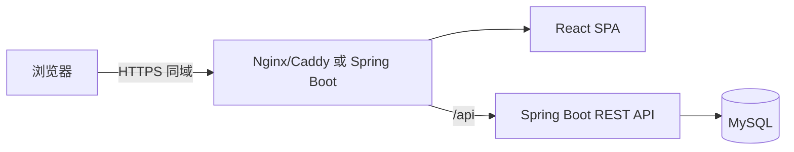

# 学习打卡系统前端技术选型与架构设计（V1.0 精简版）

## 1. 目标与最小化原则

V1.0 是面向桌面与移动浏览器的响应式 React SPA，只服务清单型刷题：注册登录、任务管理、xlsx 导入、今日题目、文字题解、自动打卡、日历与补打。

1. 与 Spring Boot REST API 直接通信，不建立 BFF、SSR、微前端或原生 App。
2. 服务端是唯一事实来源；前端只保存内存查询缓存和必要 UI 状态，不做离线同步。
3. 只支持文字题解，不做图片选择、上传、预览和文件下载。
4. 只支持 daily 清单任务；不做习惯型、暂停、归档、提前完成。

## 2. 技术选型

| 领域 | V1.0 选型 |
| --- | --- |
| 应用形态 | React SPA |
| 语言与构建 | TypeScript 5.x + React 19 + Vite 6.x |
| 路由 | React Router 7.x |
| UI | Ant Design 5.x + `@ant-design/icons` |
| 服务端状态 | TanStack Query 5.x |
| 表单 | React Hook Form 7.x + Zod 3.x |
| HTTP | 原生 `fetch` 封装，Cookie + CSRF |
| 日期 | Day.js |
| 样式 | Ant Design Token + CSS Modules |
| 测试 | Vitest + Testing Library + MSW + Playwright |

不采用 Redux/Zustand、GraphQL、WebSocket、PWA、Tailwind、独立 Node BFF。

## 3. 总体架构



生产静态资源和 API 使用同一域名；开发时 Vite 以 `/api` 代理到后端。

### 3.1 前端目录与模块边界

```text
src/
  app/              # 路由、初始化、Provider、错误边界
  api/              # fetch 客户端、端点、DTO、错误映射
  features/
    auth/           # 注册、登录、会话恢复、退出
    dashboard/      # 今日页、进度摘要
    tasks/          # 任务列表、创建/编辑/启用/删除
    items/          # 条目、解析查看、文字题解、完成/撤销
    imports/        # xlsx 上传、预览、简单去重、确认
    checkins/       # 日历、日期详情、补打、连续天数
  components/       # 不理解领域规则的通用组件
  hooks/            # 通用 hooks
  lib/              # 日期、格式化、校验工具
  styles/           # 全局样式
  test/             # MSW handlers、测试工具、fixtures
```

不建立 habit、file、submission 独立 feature。

## 4. 页面与路由

| 路由 | 页面 | 主要能力 | 访问控制 |
| --- | --- | --- | --- |
| `/login` | 登录 | 邮箱密码登录 | 未登录 |
| `/register` | 注册 | 邮箱、密码、确认密码 | 未登录 |
| `/today` | 今日 | 今日任务、进度、连续摘要 | 必须登录 |
| `/tasks` | 任务列表 | 创建、筛选、打开详情 | 必须登录 |
| `/tasks/new` | 创建任务 | 名称、日期、每日目标、初始条目 | 必须登录 |
| `/tasks/:taskId` | 任务详情 | 概览、今日条目、全部条目、导入 | 必须登录且归属当前用户 |
| `/tasks/:taskId/study` | 今日学习 | 题目、解析、文字题解、完成/撤销 | 必须登录且归属当前用户 |
| `/tasks/:taskId/import` | xlsx 导入 | 上传、预览、去重、确认 | 必须登录且归属当前用户 |
| `/calendar` | 日历 | 月视图、日期详情、补打 | 必须登录 |
| `/settings` | 设置 | 默认时区、登出 | 必须登录 |
| `*` | 404 | 返回合适入口 | 视会话 |

任务只展示创建、编辑、启用、删除；不展示暂停/恢复/归档。

## 5. 核心交互

### 5.1 今日学习

1. 服务端返回今日顺序与目标，前端不得自行重排或推算归属。
2. 每行显示标题、题面、完成状态、题解状态；有 `analysis` 时显示查看解析。
3. 解析使用抽屉/弹窗纯文本展示，绝不改变完成状态。
4. 题解编辑器只有多行文字输入和“完成本题”；去空白后为空时前端阻止并由后端再次校验。
5. 完成最后目标条目后，服务端已自动生成当日打卡；前端显示完成反馈，不发送第二次清单打卡请求。
6. 非今日目标条目不显示完成按钮（无提前完成）。

### 5.2 任务表单

分步或分区表单：基础信息、每日计划、条目录入。清单任务无条目时可保存草稿，不能启用；删除必须二次确认。

### 5.3 xlsx 导入

1. 仅接受 `.xlsx`，前端限制大小并在上传前提示。
2. 发送后显示解析中；后端同步返回预览结果，不做后台轮询。
3. 预览显示总行数、有效行、错误行、重复标题；用户可逐行选择跳过或保留新增。
4. 确认使用 `Idempotency-Key`；成功后失效任务、条目和导入预览缓存。
5. 不提供合并、覆盖、PDF、DOCX、CSV 或图片导入入口。

### 5.4 日历与补打

- 月视图用文字、图标和颜色共同表示 completed/partial/missed/makeup/无计划。
- 点击日期查看计划数量、完成数量、补打原因和题解摘要。
- 仅过去 3 天内合格日期显示补打入口；原因非空；提交中防重复。
- 补打成功失效今日、日历、任务详情和统计缓存。

## 6. API 客户端与缓存

所有请求经 `apiClient`：

1. `credentials: 'include'`。
2. 写请求自动注入内存 CSRF Token。
3. 完成、撤销、补打、xlsx 确认使用并复用 `Idempotency-Key`。
4. 统一映射 401/403/409/422/429/5xx 和网络错误。
5. 不记录密码、Cookie、CSRF、题解全文或本地文件路径。

推荐 Query Key：

| 数据 | Query Key | 刷新时机 |
| --- | --- | --- |
| 当前用户 | `['auth', 'me']` | 登录、登出 |
| 今日 | `['today', date, timezone]` | 条目完成/撤销、补打 |
| 任务列表 | `['tasks', filters]` | 创建、编辑、启用、删除 |
| 任务详情 | `['task', taskId]` | 任务/条目/导入变化 |
| 条目 | `['task-items', taskId, filters]` | 完成、撤销、确认导入 |
| 日历 | `['calendar', month, taskId]` | 完成、补打、撤销 |

Mutation 成功后以服务端响应为准并精确失效相关 key，不手工拼接进度数字。

## 7. 数据展示与可访问性

1. 日期-only 使用 `YYYY-MM-DD`，避免 UTC 偏移；日期计算按任务时区。
2. 题面、解析、题解均按纯文本展示，使用 CSS 保留换行，不用 `dangerouslySetInnerHTML`。
3. 加载使用骨架屏；错误提供重试且不丢表单；空状态给出下一步。
4. 桌面表格在移动端转为列表；长标题可换行。
5. 状态不只依赖颜色；图标按钮有 `aria-label` 与 Tooltip；弹窗支持 Esc、焦点管理和键盘操作。

## 8. 本地存储

| 数据 | 存储 | 生命周期 |
| --- | --- | --- |
| Session | HttpOnly Cookie | 后端控制 |
| CSRF Token | 内存 | 刷新即重新获取 |
| Query 缓存 | 内存 | 刷新即失效 |
| UI 偏好 | 可选 localStorage | 用户重置/版本迁移 |

V1.0 不持久化题解草稿；写操作必须联网。

## 9. 测试与验收

| 层级 | 重点 |
| --- | --- |
| Vitest | 日期/时区、校验、进度展示、错误映射、去重规则 |
| RTL + MSW | 登录、任务表单、xlsx 预览确认、空题解、完成/撤销、日历补打 |
| Playwright | 注册登录、创建任务、xlsx 导入、完成 N 题、顺延、日历补打 |
| 手工兼容 | Chrome/Edge/Safari/Firefox，桌面/移动，键盘与弹窗 |

关键验收：空题解不可完成；完成最后一题无第二次打卡请求；重复 xlsx 标题默认跳过；补打不增加连续天数；两浏览器看到服务端最新数据。

## 10. 开发顺序

| 阶段 | 前端交付 | 依赖 |
| --- | --- | --- |
| F1 | API Client、登录注册、Session/CSRF | 认证 API |
| F2 | 主框架、任务列表、创建/编辑/删除 | 任务 API |
| F3 | 条目页、xlsx 预览确认、文字题解、完成/撤销 | 条目/导入/完成 API |
| F4 | 今日页、日历、连续天数、补打、E2E | 今日/打卡 API |
| F5 | 同域部署、可访问性与回归 | 部署环境 |
