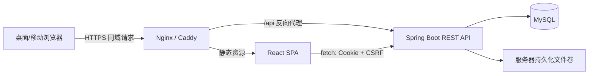

# 学习打卡系统前端技术选型与架构设计（V1.0）

## 1. 目标与最小化原则

V1.0 前端是面向桌面与移动浏览器的响应式 Web 单页应用（SPA）。它服务于个人学习打卡闭环：注册登录、今日任务、清单条目与图文题解、资料导入校对、习惯打卡、日历记录和任务管理。

实施原则：

1. 只交付一个 Web 前端项目，与 Spring Boot REST API 直接通信；不建立 BFF、微前端、SSR 或原生 App。
2. 优先保障清单型任务主路径：看到题目、按需查看解析、写题解或上传图片、完成本题、完成今日目标。
3. 认证使用后端 Session Cookie；前端不保存密码、Session ID 或访问令牌。
4. 服务端是唯一事实来源。前端只保存必要的 UI 偏好、未提交草稿和短期缓存。
5. 不实现 PWA、Service Worker、完整离线操作队列、浏览器推送或实时 WebSocket。断网时可保留本地题解草稿，联网后由用户明确提交。
6. 复用浏览器、组件库与后端 API 能力，避免为 V1.0 引入复杂状态机、全局事件总线或专用同步服务。

说明：PRD 中的“离线操作恢复后同步”属于完整离线同步能力，涉及写入队列、幂等重放、文件断点上传与冲突交互，不符合本期最小方案。V1.0 调整为“本地保留未提交文字草稿，写操作须联网”；完整离线同步纳入后续版本。

## 2. 技术选型

| 领域 | V1.0 选型 | 理由 |
| --- | --- | --- |
| 应用形态 | React 单页应用（SPA） | 页面交互密集，直接消费 REST API；部署为静态资源即可。 |
| 语言与构建 | TypeScript 5.x + React 19 + Vite 6.x | 类型覆盖接口和表单数据，启动与构建速度快，工程配置轻。 |
| 路由 | React Router 7.x（Data/Declarative Router） | 支持受保护路由、嵌套路由、URL 参数与 404 页。 |
| UI 组件 | Ant Design 5.x | 任务表单、抽屉、弹窗、上传、日历、表格与移动端响应式布局齐全，避免自建基础组件。 |
| 图标 | `@ant-design/icons` | 与组件库一致，满足导航、操作和状态图标需求。 |
| 服务端状态 | TanStack Query 5.x | 请求缓存、失效刷新、加载/错误状态、轮询与 Mutation 重试均可复用。 |
| 本地 UI 状态 | React Context + `useState` / `useReducer` | 仅管理主题、用户偏好、抽屉与局部交互；V1.0 不需要 Redux/Zustand。 |
| 表单与校验 | React Hook Form 7.x + Zod 3.x | 降低复杂表单重渲染；共享声明式校验规则与错误信息。 |
| HTTP | 浏览器原生 `fetch` 封装 | 自动携带 Cookie，统一注入 CSRF、请求 ID、超时和错误映射，无需 Axios。 |
| 样式 | Ant Design Token + CSS Modules | 统一主题与组件风格；页面布局样式局部隔离，避免 Tailwind 与组件库并存。 |
| 日期处理 | Day.js | 与 Ant Design 适配，处理用户时区下的日期、日历和提醒时间。 |
| 测试 | Vitest + React Testing Library + MSW + Playwright | 分别覆盖单元/组件、接口模拟和关键用户流程。 |
| 质量工具 | ESLint + typescript-eslint + Prettier + Husky/lint-staged | 在提交前拦截类型、格式与明显质量问题。 |
| 部署 | Nginx 静态文件容器或由 Spring Boot 托管构建产物 | V1.0 优先和后端同域部署，减少 CORS、Cookie 与 CSRF 配置。 |

明确不采用：Next.js/Nuxt SSR、Redux、MobX、GraphQL、WebSocket、PWA 离线队列、Tailwind、微前端及独立 Node.js BFF。

## 3. 总体架构



### 3.1 同域部署约定

1. Web 静态资源发布在根路径 `/`，API 固定前缀为 `/api/v1`。
2. 生产环境前端和 API 使用同一站点域名及 HTTPS，浏览器自动发送 `HttpOnly` Session Cookie。
3. Vite 开发服务器通过 `/api` 代理到本地 Spring Boot，保持开发与生产请求路径一致。
4. 若临时跨域部署，后端必须仅允许指定前端 Origin、允许凭据并配置 CSRF；V1.0 生产环境不推荐此方式。

### 3.2 前端目录与模块边界

```text
src/
  app/              # 路由、应用初始化、全局 Provider、错误边界
  api/              # fetch 客户端、端点模块、DTO 与错误映射
  features/
    auth/           # 注册、登录、会话恢复、退出
    dashboard/      # 今日页、站内到期/逾期提示
    tasks/          # 任务列表、创建/编辑、详情与设置
    items/          # 学习条目、解析抽屉、题解编辑、完成/撤销
    checkins/       # 习惯打卡、补打、历史记录、日历
    imports/        # 文件上传、解析轮询、候选题校对、去重确认
  components/       # 跨业务通用展示组件，不承载领域规则
  hooks/            # 通用 hooks，如节流、草稿、媒体查询
  lib/              # 日期、格式化、文件限制、常量与工具函数
  styles/           # 全局 reset、Token 覆盖、布局基础样式
  test/             # MSW handlers、测试工具与 fixtures
```

规则：页面仅组合 `features` 的组件和 hooks；领域请求只能从对应 `api` 模块发起；接口 DTO 不直接泄漏到纯展示组件。一个跨模块组件若开始理解任务、题目或导入规则，应下沉回相应 feature。

## 4. 页面与路由信息架构

| 路由 | 页面 | 主要能力 | 访问控制 |
| --- | --- | --- | --- |
| `/login` | 登录 | 邮箱、密码、登录失败提示 | 仅未登录 |
| `/register` | 注册 | 邮箱、密码、确认密码、服务条款确认 | 仅未登录 |
| `/today` | 今日 | 今日总览、待完成任务、站内提醒、快捷打卡 | 必须登录 |
| `/tasks` | 任务列表 | 按状态/类型浏览，创建任务 | 必须登录 |
| `/tasks/new` | 创建任务 | 清单型/习惯型配置与初始条目录入 | 必须登录 |
| `/tasks/:taskId` | 任务详情 | 概览、今日条目、全部条目、记录、设置 | 必须登录且资源归属当前用户 |
| `/tasks/:taskId/study` | 今日学习条目 | 题目列表、查看解析、题解草稿/提交、完成状态 | 必须登录且资源归属当前用户 |
| `/tasks/:taskId/imports` | 导入记录 | 上传资料、导入批次、解析状态 | 必须登录且资源归属当前用户 |
| `/imports/:batchId/review` | 导入校对 | 候选题编辑、低置信度提示、重复项处理、确认入库 | 必须登录且资源归属当前用户 |
| `/calendar` | 打卡日历 | 月视图、按任务筛选、补打入口 | 必须登录 |
| `/settings` | 设置 | 账号、时区、提醒和补打偏好 | 必须登录 |
| `*` | 404 | 返回今日页或登录页 | 视会话状态 |

应用主框架为桌面左侧导航加内容区、移动端底部导航加顶部标题栏。主要入口固定为“今日、任务、日历、设置”；“新建任务”使用图标按钮并带文字标签。布局断点只改变导航和列表排布，不改变核心流程或隐藏必要操作。

## 5. 清单型打卡交互设计

### 5.1 今日学习条目页

页面按服务器返回的条目顺序展示当天分配项，并在顶部稳定显示“已完成数量 / 今日目标”和任务总进度。每个条目至少包含题号、标题、完成状态、题解状态与操作入口。

1. `查看解析` 只在 `analysis` 非空时展示，使用右侧抽屉显示题库解析、来源页码和解析版本；查看解析不会改变完成状态。
2. 点击条目或“写题解”展开题解编辑器。编辑器包含多行文本、题解图片、保存草稿、完成本题；文本或至少一张上传成功的图片是完成前提。
3. 保存草稿只调用草稿接口或本地草稿存储，不能改变条目完成状态或当天进度。
4. `完成本题` 成功后立即使当前条目、今日进度和任务总进度失效刷新；按钮处于请求中时不可重复点击。
5. 全部目标条目完成时，服务端在同一事务中自动完成当日打卡（DEC-09）。前端弹出完成弹窗并展示“打卡”按钮：点击确认完成并关闭弹窗；若用户直接关闭弹窗，当日打卡同样已为完成状态。前端不发送第二次清单打卡写请求，也不手工拼接统计。
6. 提前完成入口位于“全部条目”标签页，必须明确标注其计入总进度但不提前创建未来打卡记录。

### 5.2 习惯型打卡

今日卡片提供单一主操作“今日已打卡”。有数量目标时展示实际完成量；有备注必填规则时先显示备注输入。成功后卡片切换为完成状态，可进入记录详情修改允许编辑的字段。

### 5.3 任务创建与编辑

使用分步表单而非长页面：

1. 基础信息：名称、描述、任务类型。
2. 计划规则：开始日期、频率、提醒时间、每日目标。
3. 清单型内容：手工新增、粘贴、CSV 或资料导入；无条目时保存为草稿，不能启用。
4. 提交前显示字段错误摘要，失败后保留用户已填内容。

任务编辑携带 `If-Match-Version`。服务器返回 `409 Conflict` 时弹出冲突对话框，展示本地编辑时间和服务器最新摘要，允许刷新后重新编辑；V1.0 不做自动字段合并。

## 6. API 集成、认证与并发

### 6.1 fetch 客户端约定

所有请求经 `apiClient` 发送，统一执行以下动作：

1. 使用 `credentials: 'include'` 发送 Cookie。
2. 对 `POST`、`PUT`、`PATCH`、`DELETE` 自动从内存中的 CSRF Token 注入 `X-CSRF-Token`。
3. 对完成题目、撤销完成、习惯打卡、补打、确认导入等防重复写接口生成 UUID `Idempotency-Key`；同一用户点击重试复用该键。
4. 对任务、题解和导入候选项更新传递 `If-Match-Version`。
5. 将响应标准化为 `ApiError`：`401` 会话失效、`403` 无权限/CSRF、`409` 版本冲突、`422` 字段校验、`429` 限流、`5xx` 服务异常。

应用启动时请求 `GET /api/v1/auth/me` 和 `GET /api/v1/auth/csrf`。`401` 清理前端用户状态并跳转登录页；不得因网络异常误判为登出。CSRF Token 只留在运行内存，刷新页面后重新获取。

### 6.2 Query Key 与缓存失效

推荐 Query Key：

| 数据 | Query Key 示例 | 刷新时机 |
| --- | --- | --- |
| 当前用户 | `['auth', 'me']` | 登录、登出、设置更新 |
| 今日总览 | `['today', date, timezone]` | 任一打卡、条目完成/撤销、任务计划更新 |
| 任务列表 | `['tasks', filters]` | 创建、编辑、归档、删除任务 |
| 任务详情 | `['task', taskId]` | 任务编辑、条目/导入变动 |
| 学习条目 | `['task-items', taskId, filters]` | 提交题解、完成/撤销、导入确认 |
| 导入批次 | `['import', batchId]` | 上传后、轮询解析、确认入库 |
| 日历 | `['calendar', month, taskId]` | 完成、补打、撤销打卡 |

Mutation 成功后优先失效受影响 key，不手工拼接统计数字。仅在按钮状态等局部且可回滚的场景使用乐观更新；完成本题、确认导入和补打以服务端返回结果为准。

## 7. 文件上传与导入校对

### 7.1 上传约束

1. 资料类型接受 PDF、DOCX、CSV 和图片；题解图片只接受后端白名单中的图片 MIME。前端限制与后端一致，单文件最大 50 MB。
2. 上传前展示文件名、大小、类型和客户端 SHA-256 计算状态。客户端哈希用于改善重复提示，服务端重新计算的 SHA-256 才是最终依据。
3. 使用 `FormData` 与 XMLHttpRequest 或支持上传进度的封装发送请求；显示每个文件独立的进度、成功、失败与重试状态。
4. 服务端判定同任务同哈希重复时，显示既有批次入口，不增加文件或候选题数量。
5. 上传成功跳转或刷新至批次详情；解析中以 5 秒间隔轮询 `GET /imports/{batchId}`，在 `REVIEW_READY`、`COMPLETED`、`FAILED` 终态停止轮询（状态枚举与 DEC-16 一致），离开页面即取消。

### 7.2 解析预览与去重确认

预览页使用虚拟列表或分页表格，避免大量候选题同时渲染。

1. 头部显示已识别题目数、含解析数、无解析数和低置信度数。
2. 每行可编辑标题、题干、解析，展示来源页和解析置信度。
3. 疑似重复项展示已有题目摘要，用户在“跳过、保留新增、合并到已有题目”三种操作中选择；默认是跳过。
4. 确认导入前进行客户端必填校验，提交时使用 `Idempotency-Key`。成功后回到任务条目页并失效任务、条目和导入相关缓存。
5. `FAILED` 状态展示服务端给出的受控失败摘要与重新上传入口，绝不把堆栈、绝对文件路径或解析器内部细节展示给用户。

## 8. 数据展示、可用性与视觉规范

1. 所有日期按当前用户时区展示，日期-only 值使用 `YYYY-MM-DD`，避免浏览器按 UTC 解析造成日期偏移。
2. 题库解析、用户题解与题目正文按纯文本展示，使用 CSS 保留换行并默认转义 HTML，不使用 `dangerouslySetInnerHTML`。
3. 题解图片提供缩略图、预览、删除和上传失败重试；删除尚未保存的图片只影响前端队列，已上传文件需调用受鉴权的删除/解绑接口。
4. 加载状态使用内容骨架屏；空状态给出任务创建、导入或查看历史等明确下一步；错误状态提供重试且不丢失表单内容。
5. 桌面表格在移动端转为列表；任务名称、题目标题可换行，不依赖横向滚动完成关键操作。
6. 不以颜色作为唯一状态标识。完成、漏打、补打、低置信度和错误均同时使用图标与文字。
7. 所有图标按钮提供 `aria-label` 与 Tooltip；抽屉、弹窗支持焦点管理、Esc 关闭和键盘操作。

## 9. 本地存储策略

| 数据 | 存储位置 | 生命周期 |
| --- | --- | --- |
| Session 与认证凭据 | 仅 `HttpOnly` Cookie，由后端控制 | 后端会话过期或登出后失效 |
| CSRF Token | 内存 | 页面刷新即重新获取 |
| TanStack Query 缓存 | 内存 | 刷新页面失效；V1.0 不持久化敏感数据 |
| 题解文字草稿 | `localStorage`，以 `userId + itemId` 隔离 | 提交成功、主动丢弃或 30 天后清理 |
| UI 偏好（导航折叠等） | `localStorage` | 用户主动重置或版本升级时迁移 |

图片文件不放入 `localStorage` 或 IndexedDB。断网期间图片上传失败时保留当前页面选择状态并提示重新联网提交；刷新后需重新选择文件。

## 10. 安全与质量要求

1. 前端不记录或输出密码、Cookie、CSRF Token、题解全文及本地绝对文件路径到日志、埋点或错误上报。
2. 所有用户输入在 React 默认转义机制下渲染；外部 URL 和下载链接必须由后端提供且经过归属鉴权。
3. 路由守卫仅改善体验，资源访问控制始终以服务端为准。任何 `taskId`、`itemId`、`batchId` 都不得因前端校验通过而被视为有权限。
4. 上传类型、大小、哈希和题解必填校验在前端提示，在后端强制执行。
5. 生产 Source Map 默认关闭或上传至受控错误平台，禁止公开暴露内部源码路径。
6. Content Security Policy 至少限制脚本、图片、连接和 frame 来源为本站；上传预览使用本地 Blob URL 并在组件卸载时释放。

## 11. 测试与验收

| 层级 | 工具 | V1.0 重点用例 |
| --- | --- | --- |
| 单元测试 | Vitest | 日期/时区、输入校验、进度展示、API 错误映射、草稿键生成。 |
| 组件测试 | React Testing Library + MSW | 登录失败、清单题解必填、无解析不显示入口、冲突弹窗、上传失败重试。 |
| 端到端测试 | Playwright | 注册登录、创建清单任务、完成题解、上传并校对导入、习惯打卡、补打。 |
| 手工兼容性 | Chrome、Edge、Safari 移动端 | Cookie 会话、文件选择、抽屉/弹窗、窄屏文字换行和日历操作。 |

关键验收：

1. 用户在两台浏览器登录同一账号，刷新后均看到后端最新的任务、条目和打卡记录。
2. 没有解析的条目不显示“查看解析”；查看解析不会完成条目。
3. 只有有效文字或至少一张上传成功的题解图片时，才能完成清单条目。
4. 网络重试不会让一次完成本题、确认导入或补打产生重复记录。
5. `409 Conflict` 不覆盖服务器最新数据，用户可刷新后重新编辑。
6. PDF/DOCX/CSV 上传后可看到解析中、成功或失败状态；疑似重复题必须由用户确认处理。

## 12. 开发顺序

| 阶段 | 前端交付内容 | 依赖的后端能力 | 验收重点 |
| --- | --- | --- | --- |
| F1 | Vite 工程、路由、Ant Design 主题、API Client、登录注册、Session/CSRF | 认证 API、`/auth/me`、`/auth/csrf` | 刷新仍可恢复会话，401 正确回到登录。 |
| F2 | 主框架、今日页、任务列表、创建/编辑任务 | 任务/计划/今日 API | 清单和习惯任务均可创建并展示。 |
| F3 | 今日学习条目、解析抽屉、题解草稿、完成/撤销 | 条目、题解、完成 API | 每题完成规则与服务端一致，进度实时刷新。 |
| F4 | 资料上传、批次状态轮询、解析预览、去重确认 | 文件与导入 API | 上传不阻塞页面，候选题可校对后确认。 |
| F5 | 日历、补打、设置、可访问性与 E2E 回归 | 打卡、统计、设置 API | 移动端可完整完成主流程，关键场景自动化通过。 |
| F6 | Docker/Nginx 构建、监控错误边界、性能检查 | 同域部署环境 | 首屏、上传和大候选题列表满足可用性目标。 |

## 13. 后续演进边界

| 触发信号 | 后续升级 |
| --- | --- |
| 需要真正离线打卡 | 引入 PWA、IndexedDB 操作队列、后台同步与文件重试协议。 |
| 页面首屏或 SEO 成为核心诉求 | 评估 SSR/预渲染，但需重新设计 Cookie 与 API 边界。 |
| 前端跨团队、多业务独立发布 | 评估 monorepo、设计系统包或微前端，不在早期拆分。 |
| 多人协作与实时学习房间 | 评估 WebSocket/SSE 与事件状态模型。 |
| 大量任务和题库数据 | 加强列表虚拟化、服务端分页、缓存持久化和性能监控。 |

在这些信号出现之前，SPA 加 REST API 的单前端工程足以支撑 V1.0，额外架构只会增加维护成本。
